# dPH+ Rooms

## Managing Room Data (TFA, Vn50, Ventilation) in SketchUp for PHPP

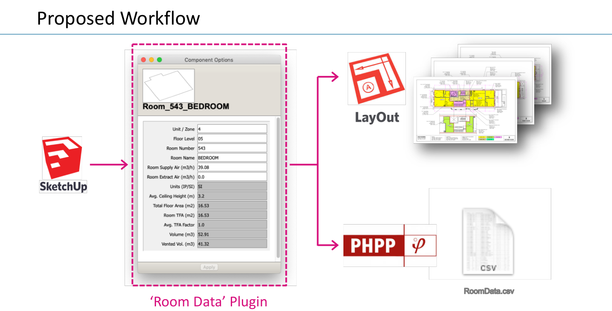

When a woodworker faces a difficult or unusual cut, they will often stop and build a "jig": a temporary, purpose-built tool that makes the cut accurate and repeatable. The jig costs some time up front, and it pays that time back in the quality of the finished work. People who work with large amounts of building data on a computer should be willing to do the same thing. dPH+ Rooms is one of those digital jigs. It is a small SketchUp extension that lets the 3D model hold, calculate, and report room-by-room data for Passive House certification.

The tool was presented at the 23rd International Passive House Conference (Gaobeidian, China, October 2019) in the paper *Using Sketchup as an Information Modeler for Enhancing Accuracy and Simplifying Certification*.

Note: this extension is NOT part of, or associated in any way with, the DesignPH plugin or the Passive House Institute. It adds a set of room tools to SketchUp for people who already use DesignPH to build PHPP models.

### The Problem: Net Interior Volume (Vn50)

DesignPH handles the envelope data well: surface areas, U-values, window sizes. It does not handle the room-level data. Every PHPP model needs the net interior reference volume (Vn50), the sum of the clear volumes of all the interior rooms. It drives the airtightness and energy calculations, it is tedious to calculate, and it is a common source of error. It also has to be recalculated every time the floor plans change.

PHPP has no worksheet for logging room-level data, so most consultants keep a secondary spreadsheet of rooms, areas, and volumes. Now the drawings, the spreadsheet, and the PHPP all have to agree, every design change has to be entered in each of them, and the certifier needs some way to check how the numbers were derived. On a small project this is tedious. On a large or complicated one it is close to unmanageable.

The alternative is to let the 3D model be the single source of room data. SketchUp calculates the areas and volumes directly from the geometry, geometric mistakes are easy to spot by eye, and there is no spreadsheet to keep in sync.

### Example Project

The images below come from a mixed-use building in New York City: a commercial ground floor with residential units above, EnerPHit certification, 473 m² of residential TFA. The usual DesignPH envelope model is on the left; the room-by-room model built with dPH+ Rooms is on the right.

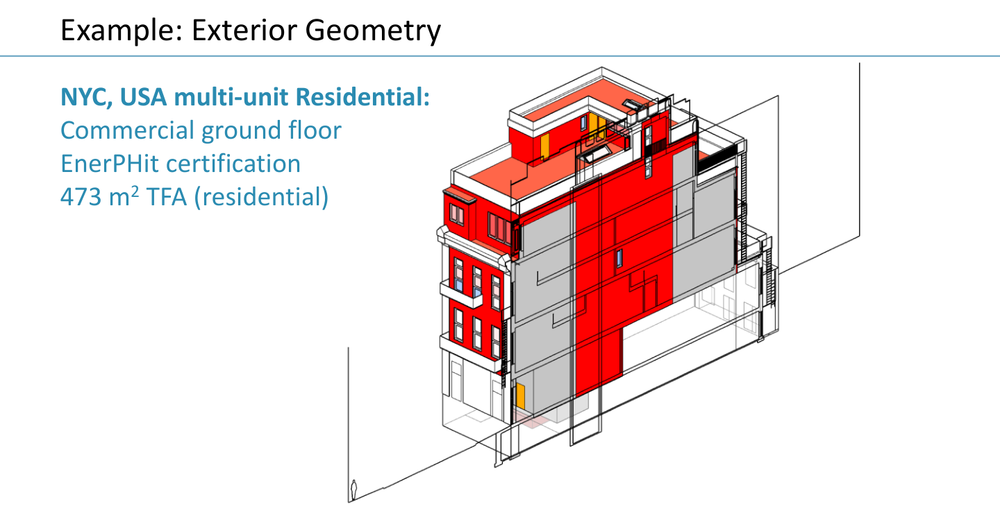

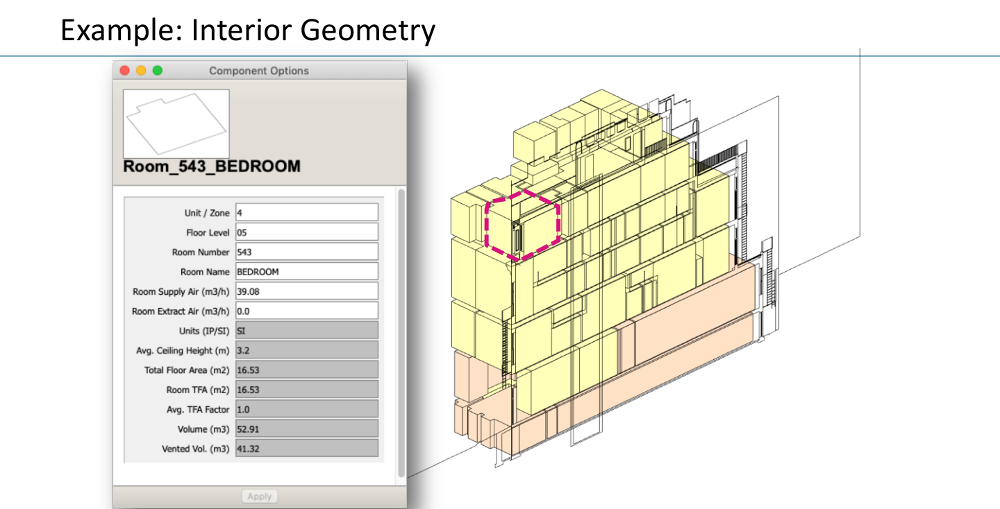

### How It Works: Dynamic Components

Every entity in SketchUp (faces, edges, groups, components) can carry an attribute dictionary of key/value pairs. dPH+ Rooms uses these in two places:

- **Components** hold information in their attribute dictionaries, and that information travels with the component wherever it goes in the scene. Attributes can be entered by the user or calculated from the component's geometry (area, volume), so they update when the geometry changes.
- **Dynamic Components** are a special kind of component with a dedicated `dynamic_attributes` dictionary. Anything stored there is shown in SketchUp's *Component Options* window and can be passed to LayOut as live Auto-Text.

Dynamic Components have no public API, and relying on them is a real long-term risk. They are used here because (as of SketchUp 2019) they are the only way to pass model data into LayOut drawings. If the drawing and reporting steps were dropped in favor of a model-only review, the extension could be built more robustly without them.

Room setup is done by the extension, never by hand. That keeps the dictionary layout identical across every room and every project, which is what makes the calculations, the CSV export, and the LayOut tags reliable.

### Step by Step Usage

If the extension is installed correctly you will have a new submenu at *Window > dPH+ Rooms*, a *dPH+ Room Data* and *dPH+ TFA* section in the right-click context menu, and a floating *dPH+ TFA* toolbar.

#### 1. Model the room geometry and tag the TFA surfaces

Model each room as a closed volume based on the plans and sections. Know the rules for which spaces count toward Vn50 before you start; the tool calculates what you model, nothing more.

Select the floor surface(s) of the room and right-click *dPH+ TFA > Set TFA-100* (or 60, 50, 30, 0). The factor is stored on the face and the face is colored to match. *Clear TFA Attrb.* removes it. Then select the room geometry and choose *Create a New dPH+ Room(s)* to turn it into a dPH+ room Dynamic Component.

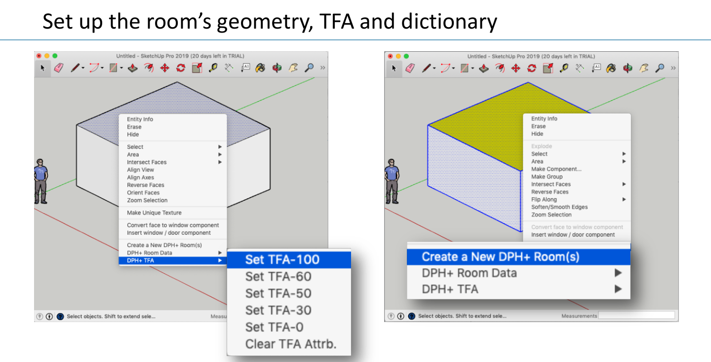

#### 2. Enter the room information

Open *Window > Component Options* with a room selected and fill in the user fields: Unit / Zone, Floor Level, Room Number, Room Name, Room Supply Air, Room Extract Air, and the assigned heat pump indoor unit (AHU), heat pump outdoor unit (OU), and H/ERV unit.

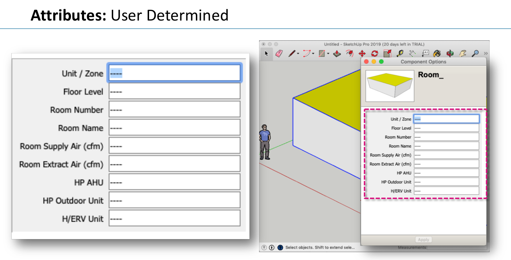

To set a value on many rooms at once, select them and use *Set Room(s): Zone / Unit*, *Floor Level*, *Heat Pump Outdoor Unit (OU)*, *Heat Pump Indoor Unit (AHU)*, or *HRV Unit*.

#### 3. Calculate the room data

Select the rooms and run *Calc Room(s) Data*. The extension reads the tagged faces and the component's volume and writes the results into the same dictionary, where they appear as read-only fields in Component Options:

| Field | Source |
|---|---|
| Total Floor Area | Sum of all tagged floor faces |
| Room TFA | Sum of tagged faces × their TFA factor |
| Avg. TFA Factor | Room TFA / Total Floor Area |
| Volume (Vn50) | Volume of the closed room component |
| Avg. Ceiling Height | Vn50 / Total Floor Area |
| Vented Volume (Vv) | Room TFA × 2.5 m (8.2 ft) |

Rerun it whenever the geometry changes. The room component is renamed `Room_<number>_<name>` so it is easy to find in the Outliner. *Remove dPH+ Attributes From Selected* strips all dPH+ data so a room can be rebuilt without exploding it.

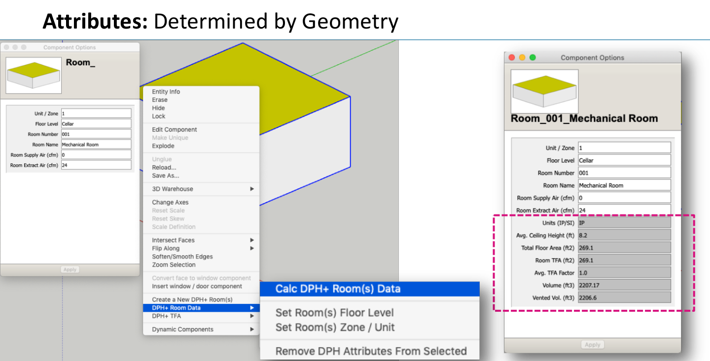

*Set SI / IP Units* switches the selected rooms between metric and imperial; it converts the stored values and the Component Options labels.

### Using the Data

Once the data lives in the model, it is edited through Component Options or recalculated from the geometry. Everything downstream (the PHPP inputs and the certification drawings) is generated from it.

#### In the model: color and select by attribute

*Color the Scene By...* colors rooms by TFA factor, ventilation (supply vs. extract rooms), HP OU, HP AHU, or H/ERV unit. This is a fast way to check assignments visually. *Select dPH+ Rooms By...* selects every room in a given zone, floor, HP OU, HP AHU, or H/ERV unit. *Output: Room Data Quick View* shows total TFA, Vn50, and Vv for the current selection in both unit systems.

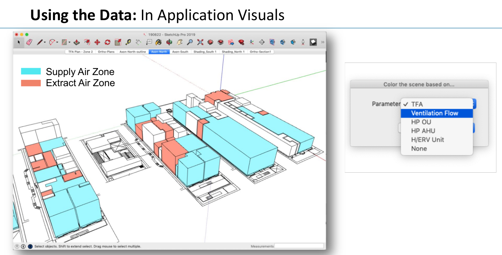

#### PHPP

Rather than write into the PHPP workbook directly (and risk the stability of the file), the extension writes a CSV that you copy and paste into PHPP. There are two exports:

- *Output: All Room Data* writes every attribute of every room, grouped by zone: zone, floor, room number and name, supply and extract airflow, TFA, net floor area, average TFA factor, Vn50, Vv, ceiling height, HP OU, HP AHU, H/ERV, and the SketchUp persistent ID.
- *Output: Room Data for PHPP Addn'l Vent* writes the columns in the order of the PHPP *Additional Vent* worksheet: amount, room name, allocation to ventilation unit, area, Vv reference height, supply airflow, and extract airflow. On most projects of any size, *Additional Vent* is the main input sheet for the ventilation system.

The total Vn50 for the *Ventilation* worksheet is the sum of the room volumes (use Quick View or the full export).

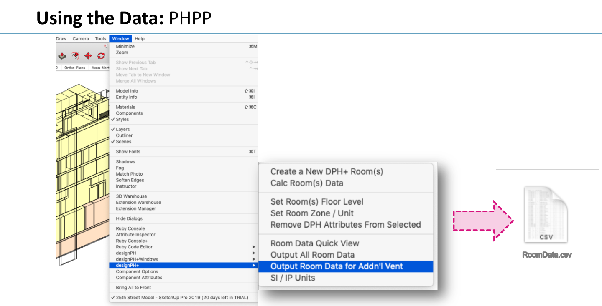

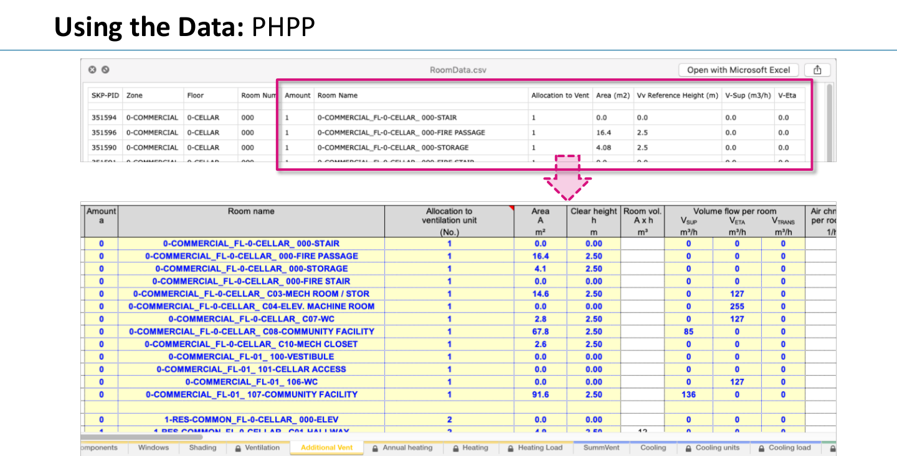

#### SketchUp LayOut

LayOut, SketchUp's companion drawing application, links model views into drawing sheets. Because the rooms are Dynamic Components, LayOut's Auto-Text labels can read their attributes directly. Send the model to LayOut, set up the plan and section views, and add labels that point at the room data:

```
Room: <DynamicComponent(3roomnum)>-<DynamicComponent(4roomname)>
TFA: <DynamicComponent(tfa)> m2
Vn50: <DynamicComponent(vn50)> m3
Clg Height: <DynamicComponent(avgheight)> m
V-Sup: <DynamicComponent(5supplyair)> m3/h
V-Extr: <DynamicComponent(6extractair)> m3/h
```

When the model changes, the areas, volumes, and labels in the drawings update with it. Nobody edits a drawing or a table by hand.

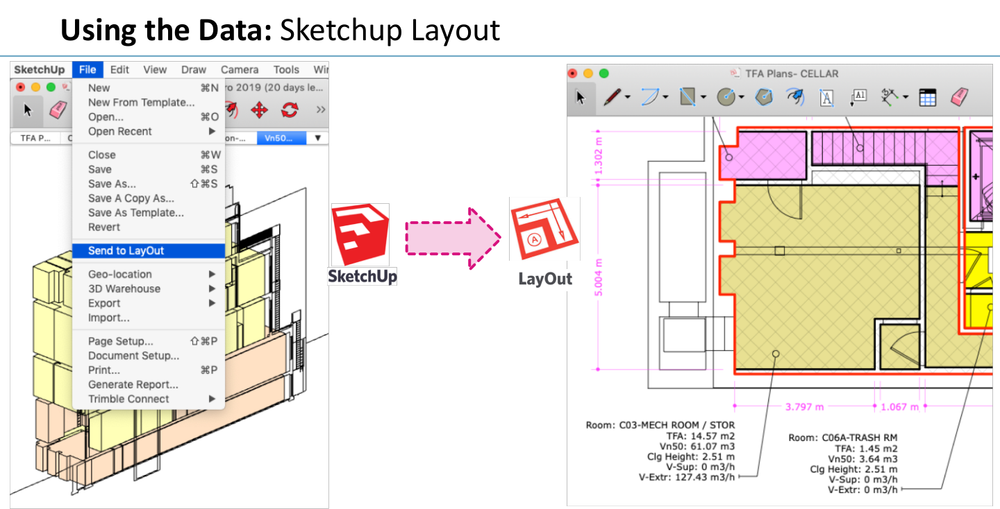

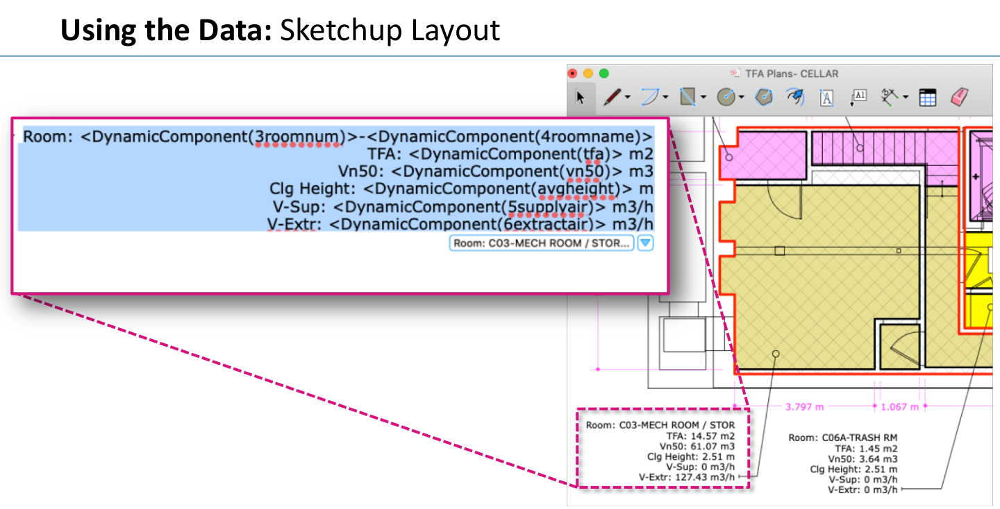

Other attribute keys available to Auto-Text: `1zone`, `2flrlevel`, `7ahu`, `8outdoorunit`, `9hrvunit`, `flrarea`, `vv`, `dphunits`.

### Download and Install: [Latest Release](https://github.com/PH-Tools/dph-plus-rooms/releases/latest)

Download the `.rbz` file from the latest release. In SketchUp, open *Window > Extension Manager*, click *Install Extension*, and select the `.rbz` file. Alternatively, copy `bt_dphPlus_rooms_Load.rb` and the `bt_dphPlus_rooms` folder into your SketchUp `Plugins` directory (on macOS: `~/Library/Application Support/SketchUp 20XX/SketchUp/Plugins`).

Version 1.2.1 (June 2021). The workflow shown here was developed on SketchUp Pro 2019 on macOS; other versions may work but have not been tested. Make a backup copy of your `.skp` file and test the extension on it before using it on a real project. We take no responsibility for errors or issues arising from its use.

See also [dph-plus-windows](https://github.com/PH-Tools/dph-plus-windows), the companion extension for coloring DesignPH windows by their PHPP energy balance.
